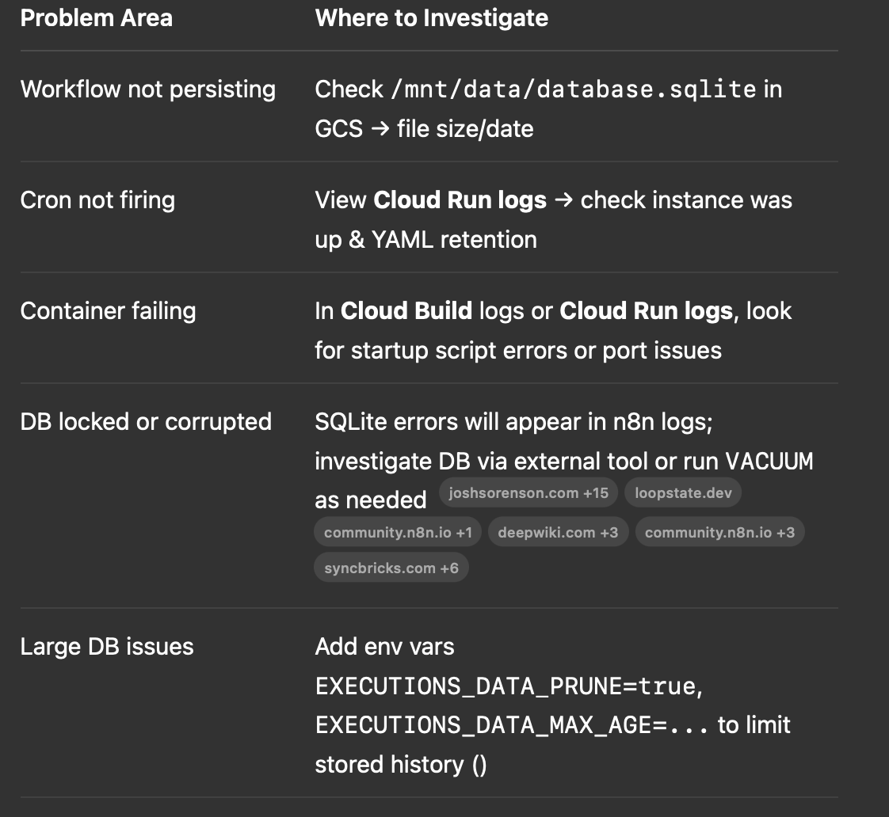

1️⃣ Role of SQLite in This Setup

SQLite serves as the local database for n8n, storing EVERYTHING the system needs:
	•	Workflow definitions — all nodes, parameters, schedules, and triggers stored as JSON in tables like workflow_entity   .
	•	Credentials — encrypted login tokens/API keys stored securely in credentials_entity  .
	•	Execution history — metadata and logs of each run (time, success/error) in execution_entity and execution_data  .
	•	Settings and authentication data — user settings, SAML info (auth_provider_sync_history, auth_identity)  .
	•	Webhook registrations and other internal configurations.

In short, SQLite is the single source of truth for n8n’s state—workflows, credentials, logs, and runtime info. The advantage is full persistence even if the container restarts, especially when combined with GCS volume.

⸻

2️⃣ Overall Architecture of Your Deployment

Here’s a step-by-step breakdown of how each component interacts:

[GitHub Repo]      →  Cloud Build Trigger     →  [Cloud Build]
     |                    pushes code             builds → pushes Docker image
     ↓                                              ↓
[cloudbuild.yaml]  ←————————————————————→  [Cloud Run Deployment]

Once deployed:

               +-------------------+
               |  Cloud Storage    |
               |  (Bucket Volume)  |
               +--------+----------+
                        | mounts as /mnt/data in container
                        ↓
 +-----------+      +----------------+      +------------+
 | Docker in | ---> | n8n Container  | ---> | n8n SQLite |
 | Cloud Run |      | (Node runtime) |      |  DB File   |
 +-----------+      +----------------+      +------------+
        ↑                   |                     ^
        | cron/HTTP         | writes workflows,    |
        | triggers workflows| logs, executions to DB |  
        +-------------------+--------------------------+

🔄 Data Flow
	1.	Code pushed to GitHub
	2.	Cloud Build Trigger fires → builds Docker image → pushes to Container Registry
	3.	Cloud Build deploys to Cloud Run (service: n8n-sqlite)
	4.	Cloud Run spins up container (always ≥1 instance to preserve cron)
	5.	/mnt/data is a GCS-mounted volume, so SQLite DB persists across restarts
	6.	n8n stores workflows, creds, execution history—written to DB on every workflow run
	7.	Cron/HTTP triggers inside n8n run autonomously, using the persisted DB

⸻

🧩 Why This Architecture Is Resilient
	•	Persistence across restarts: GCS-backed SQLite ensures no data loss if container restarts.
	•	Low cost and simplicity: SQLite is file-based—no DB server costs or complexity.
	•	Cron reliability: min‑instances=1 keeps the container alive so scheduled triggers run on time.
	•	Scalability safe: setting max-instances=1 prevents concurrent DB access, avoiding SQLite corruption.
	•	Full automation: CI/CD via Cloud Build → automated builds & deployments on push.

⸻

🛠️ Troubleshooting Tips (Where to Look When Issues Arise)

⸻

✅ Summary
	•	SQLite: holds workflows, credentials, execution history, settings—entire config of n8n
	•	Cloud Run + GCS volume: runs container and persisting SQLite file
	•	Cloud Build/CD pipeline: automates builds and deployments on GitHub pushes
	•	Reliable scheduling and persistence: ensures the system continues running and storing data correctly

This architecture creates a lightweight, free-tier, fully automated n8n deployment that:
	1.	Persists critical data
	2.	Runs scheduled jobs reliably
	3.	Allows easy updates via git
	4.	Provides clear logs for debugging

Let me know if you want a visual diagram or help adding pruning/env-variable safeguards!